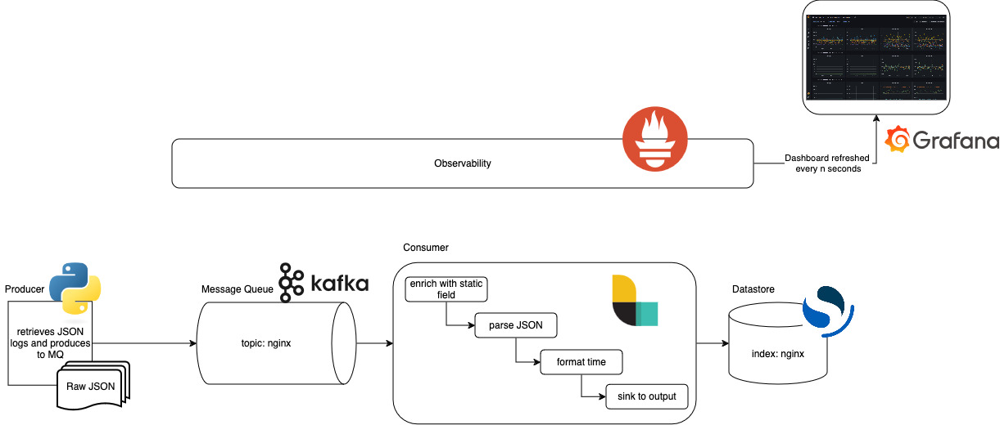

# Design Doc: Nginx Access Logs Pipeline

## Overview

This document outlines the design and implementation details of an end-to-end data pipeline for processing and visualizing nginx access metrics. From a high level, the pipeline retrieves bulk logs in JSON format, produces them to a message queue, consumes the data and performs some manipulations, and sends it downstream to a datastore.

Objectives
* Ingestion: Efficiently ingest nginx access logs (in JSON format)
* Data Processing: Transform the log data to adhere to a specified schema
* Indexing: Index the transformed data into Opensearch for visualization
* Scalability: Ensure the pipeline can handle high throughput
* Reliability: Consider fault tolerance and error handling to ensure data integrity

## Architecture



### High-Level Architecture and Data Flow

Our pipeline architecture is as follows (from left to right):
* Producer (Python): Requests access logs from url and generates a stream of log data
* Message Queue (Kafka): The logs are sent to the corresponding Kafka topic. The data is stored in our state.
* Processing (Logstash):
  * Logstash consumes the data from the Kafka topic.
  * The log data is enriched with static fields, parsed, filtered, and mutated to match the data schema. 
  * The enriched and transformed data is indexed into an Opensearch cluster.
* Monitoring: Metrics are pulled by Prometheus and visualized using Grafana.
  * Kafka exporter and JVM exporter are used to collect Kafka metrics.
  * JSON exporter is used to collect Logstash metrics for Prometheus to scrape.


### Data Ingestion

#### Source Data

The source data is bulk raw nginx access logs which are in JSON format. Although JSON is semi-structured, the logs followed a structure:
```
{"time": "17/May/2015:08:05:32 +0000", "remote_ip": "93.180.71.3", "remote_user": "-", "request": "GET /downloads/product_1 HTTP/1.1", "response": 304, "bytes": 0, "referrer": "-", "agent": "Debian APT-HTTP/1.3 (0.8.16~exp12ubuntu10.21)"}
```

An early exploratory data analysis revealed the referrer and remote user fields were most empty while the request and response fields showed the same few values. However, there were no even distributions amongst fields (nor composite fields).

A python script uses urllib to retrieve these bulk nginx logs, and the file is parsed (line by line for individual logs) and produced to Kafka. A delivery report documents the success or failure of message delivery.

Python provides an easy to use and versatile environment for read and producing JSON data. Its library support allows for quick integration with Kafka. This section of the pipeline is solely responsible for producing JSON records to a message queue, so there is no need to introduce additional complexity and resource allocation by using a producer like Logstash or Fluentd.


#### Kafka Configuration

Logs are produced to using a single topic approach with no key, leaving Kafka to evenly distribute events between topic partitions. The data is homogenous and serves a unified purpose, so this approach simplifies consumption as all related messages are within the same topic and traffic is not skewed amongst partitions. The exploratory data analysis showed that there was no convenient distribution of records amongst fields (nor composite fields), so a multiple topic or dynamic topic approach would benefit the system if additional sources of logs were included or the use case (like needing to ensure order of processing) encouraged it. 

**Considerations**: Kafka is a reliable and scalable message queue that can handle huge volumes of data. When picking a message queue, it's important to think about a few things: scalability, performance, durability, and delivery guarantees. Compared to other MQs, Kafka has a higher throughput than RabbitMQ and is more durable due to storing on disk (RabbitMQ stores in memory I believe). While this does introduce higher latency, that tradeoff is worth it that monitors logs. In the future, if this system needs to accommodate a larger quantity of data, Kafka can adapt to that better than RabbitMQ can. At the same time, Kafka can ensure ordering of events which could become important for determining the causal relationship between log info. Plus, there's flexibility with Kafka if there is a need for streaming and storage by using KSQL. You can persist messages (which you can do with RabbitMQ as well) for usage as well.

### Data Transformation

The raw logs are manipulated into this format:
```
{
    "time": 1426279439, // epoch time derived from the time field in the event
    "sourcetype": "nginx",
    "index": "nginx",
    "fields": {
        "region": "us-west-1",
        "assetid": "8972349837489237"
    },
    "event": {
        "remote_ip": "93.180.71.3",
        "remote_user": "-",
        "request": "GET /downloads/product_1 HTTP/1.1",
        "response": 304,
        "bytes": 0,
        "referrer": "-",
        "agent": "Debian APT-HTTP/1.3 (0.8.16~exp12ubuntu10.21)"
    }
}
```

#### Logstash Configuration

**Considerations**: Logstash is a data processing pipeline that ingests data from sources, transforms it, and then sends it to storage. It supports a wide range of plugins which allows for extensive customization of the data processing. In addition to its flexibility, Logstash integrates well with Kafka and Opensearch, ensuring smooth data flow. Compared to Fluentd, its performance and resource consumption are high, but this is a worthwhile tradeoff for performance in the case that the pipeline experiences increased volume and/or velocity.

**Pipeline**: Logstash consumes JSON-formatted log entries with decorated events from Kafka for access to metadata. It then filters the data before sinking it to Opensearch using a stream approach as well as to stdout for development and debugging purposes. The pipeline batch size was increased from the default to avoid data loss as Logstash lagged behind.

**Filters**: Logstash uses several mutate filters to remove unnecessary fields, add the status fields (region and assetid), and set the sourcetype and index. The raw JSON events are then parsed for access to their fields. The event time is used for the timestamp metadata (for filtering in Opensearch Dashboards), and ruby code derives epoch time from that event time.

**Error Handling**: A debug field was introduced for the timestamp to ensure that Opensearch visualizations that depended on time-series information worked.  A future improvement could implement conditional checks to filter out or log malformed entries as well as send malformed messages to an index for further analysis.

### Data Storage and Visualization

Data is indexed into Opensearch. Due to their homogenous nature, there is a single nginx index.

While the majority of the transformation happened in Logstash, a few scripted fields were added to Opensearch in order to provide more granular insights into the data such as user-agent  information, request methods and products, and “fingerprint” generation duplicate record counts.

#### Dashboard

Visualizations exist in the `Nginx Access Logs` dashboard. Key metrics like record count, unique remote_ip count, and requests per product give an overview of pipeline performance and request distribution. Composite visualizations provide additional insight into requests and response code distribution over time, most frequent remote_ips, and distribution of response types by request to highlight where traffic and errors might be concentrated concentrated.


### Monitoring

The pipeline is monitored with Prometheus and Grafana to track the health of Kafka, Logstash, and OpenSearch. While Opensearch has a convienient Prometheus plugin, Kafka and Logsearch use exporters in order to maintain a centralized hub. The introduced complexity is a tradeoff for maintainance and alerting.

Kafka metrics are collected by Kafka exporter and JVM exporter.

Logstash metrics are collect by JSON exporter for Prometheus to scrape. These metrics are especially important because they play a crucial role in detecting data loss when compared to Kafka's produced event metrics as well as alerting when resource usage is high.


